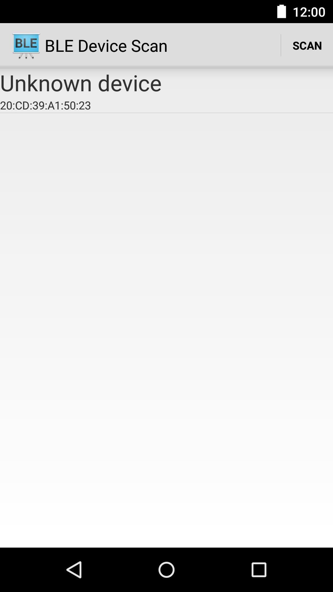
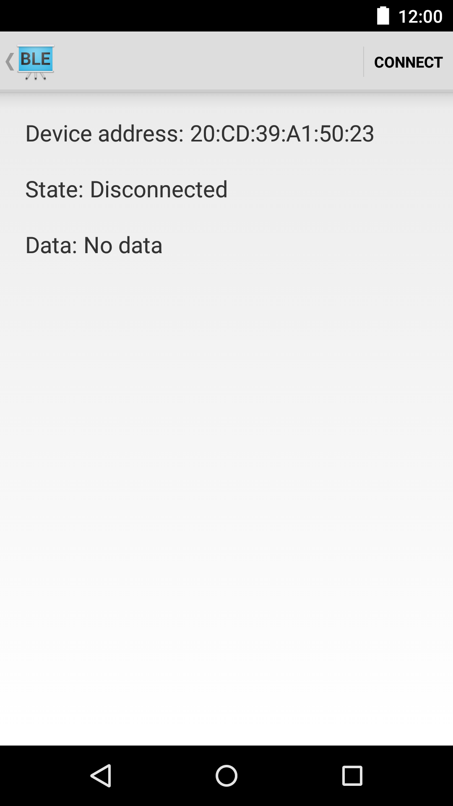

# android-hrm-sample

<!-- README-OVERVIEW-IMAGE -->


Android BluetoothLeGatt Sample
===================================

This sample demonstrates how to use the Bluetooth LE Generic Attribute Profile (GATT)
to transmit arbitrary data between devices.

Introduction
------------

This sample shows a list of available Bluetooth LE devices and provides
an interface to connect, display data and display GATT services and
characteristics supported by the devices.

It creates a [Service][1] for managing connection and data communication with a GATT server
hosted on a given Bluetooth LE device.

The Activities communicate with the Service, which in turn interacts with the [Bluetooth LE API][2].

[1]:http://developer.android.com/reference/android/app/Service.html
[2]:https://developer.android.com/reference/android/bluetooth/BluetoothGatt.html

Pre-requisites
--------------

- Android SDK v22
- Android build-tools 24.0.3
- Android Support Repository

Local verification also expects the legacy Gradle stack checked into this repo:

- Gradle wrapper 2.2.1
- Android Gradle Plugin 1.0.0
- Android support libraries 21.0.2

Configure an Android SDK path before running Gradle:

```sh
export ANDROID_HOME=/home/gjones/android-sdk
export ANDROID_SDK_ROOT=/home/gjones/android-sdk
```

Screenshots
-------------

  

Getting Started
---------------

This sample uses the Gradle build system. To build this project, use the
"gradlew build" command or use "Import Project" in Android Studio.

Run the SDK-free baseline check before Gradle:

```sh
scripts/check-baseline.sh
```

Then run Gradle with a compatible Android SDK:

```sh
ANDROID_HOME=/home/gjones/android-sdk ANDROID_SDK_ROOT=/home/gjones/android-sdk ./gradlew lint --no-daemon
ANDROID_HOME=/home/gjones/android-sdk ANDROID_SDK_ROOT=/home/gjones/android-sdk ./gradlew check --no-daemon
ANDROID_HOME=/home/gjones/android-sdk ANDROID_SDK_ROOT=/home/gjones/android-sdk ./gradlew assembleDebug --no-daemon
```

This baseline keeps the sample on its legacy Gradle and support library stack
while using HTTPS Maven Central and host-compatible Android build-tools.
`Application/lint.xml` suppresses only the obsolete lint API database error from
this old toolchain and the missing-density-folder warning for bitmap assets
intentionally kept in `drawable-nodpi`. A future modernization pass should
update Gradle, Android Gradle Plugin, AndroidX, target SDK behavior, BLE runtime
permissions, and device-backed tests together.

Support
-------

- Google+ Community: https://plus.google.com/communities/105153134372062985968
- Stack Overflow: http://stackoverflow.com/questions/tagged/android

If you've found an error in this sample, please file an issue:
https://github.com/googlesamples/android-BluetoothLeGatt

Patches are encouraged, and may be submitted by forking this project and
submitting a pull request through GitHub. Please see CONTRIBUTING.md for more details.

License
-------

Copyright 2014 The Android Open Source Project, Inc.

Licensed to the Apache Software Foundation (ASF) under one or more contributor
license agreements.  See the NOTICE file distributed with this work for
additional information regarding copyright ownership.  The ASF licenses this
file to you under the Apache License, Version 2.0 (the "License"); you may not
use this file except in compliance with the License.  You may obtain a copy of
the License at

http://www.apache.org/licenses/LICENSE-2.0

Unless required by applicable law or agreed to in writing, software
distributed under the License is distributed on an "AS IS" BASIS, WITHOUT
WARRANTIES OR CONDITIONS OF ANY KIND, either express or implied.  See the
License for the specific language governing permissions and limitations under
the License.
