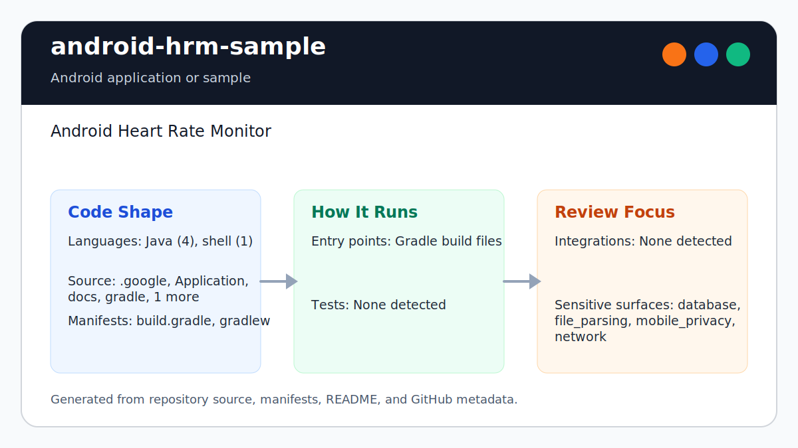
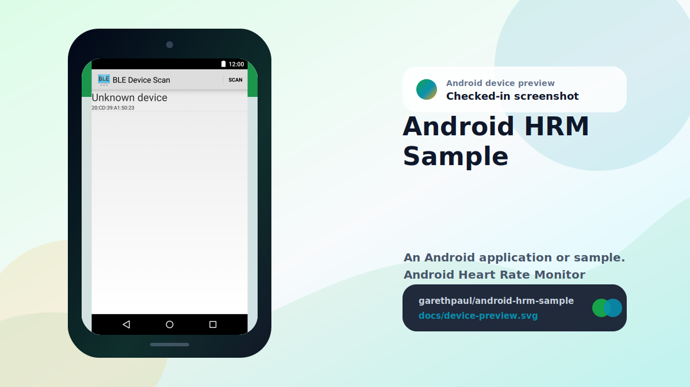

# android-hrm-sample

<!-- README-OVERVIEW-IMAGE -->


## Device Preview

<!-- DEVICE-PREVIEW-IMAGE -->


## Overview

`garethpaul/android-hrm-sample` is an Android application or sample. Android Heart Rate Monitor

This README is based on the checked-in source, manifests, scripts, and repository metadata on the `master` branch. The project language mix found during review was: Java (4), shell (1).

## Repository Contents

- `README.md` - project overview and local usage notes
- `.github/workflows/check.yml` - the supported authenticated publication gate
- `build.gradle` - Android or Gradle build configuration
- `.google` - source or example code
- `Application` - source or example code
- `docs` - source or example code
- `gradle` - source or example code
- `gradlew` - Android or Gradle build configuration
- `scripts` - source or example code
- `SECURITY.md` - security reporting and disclosure guidance
- `VISION.md` - project direction and maintenance guardrails

Additional scan context:

- Source directories: .google, Application, docs, gradle, scripts
- Dependency and build manifests: build.gradle, gradlew
- Entry points or build surfaces: Gradle build files
- Test-looking files: no obvious test files detected

## Getting Started

### Prerequisites

- Git
- Android Studio or a compatible Android SDK
- Java 8 and the checked-in Gradle wrapper

### Setup

The generated wrapper still executes Gradle 2.2.1 for compatibility. It uses
`distributionSha256Sum` to authenticate the downloaded distribution, while the
SDK-free baseline verifies the checked-in wrapper JAR and launchers. This does
not make an uncached build offline-reproducible; the first build still needs
Gradle's HTTPS distribution service.

```bash
git clone https://github.com/garethpaul/android-hrm-sample.git
cd android-hrm-sample
scripts/check-baseline.sh
./gradlew lint --no-daemon
./gradlew check --no-daemon
./gradlew assembleDebug --no-daemon
```

The setup commands above are derived from repository files. Legacy mobile, Python, or JavaScript samples may require older SDKs or package versions than a modern workstation uses by default.

## Running or Using the Project

- Use Android Studio to open the project or run `./gradlew assembleDebug` when the Android SDK is configured.

## Testing and Verification

- The pinned GitHub Actions `Check` workflow is the only supported authenticated
  publication-gate entry point. It invokes `./scripts/run-android-verification.sh`
  before any repository-controlled test step.
- The GitHub-hosted Ubuntu 24.04 runner and pinned `actions/setup-java` Corretto 8
  step are external CI trust assumptions. Repository code does not independently authenticate JDK bytes. The runner requires a clean exact
  reviewed Git tree and index, and verifies that its fresh archive matches every
  tracked blob, mode, symlink, and path in that reviewed commit.
- Make is unsupported and fails while parsing. Caller-controlled Make flags can
  otherwise skip recipes, ignore failures, replace the shell, or select another
  makefile.
- `scripts/check-baseline.sh` - runs SDK-free HRM sample baseline checks.
- The SDK-free baseline protects GATT property checks, BLE address validation,
  scan timeout cleanup, heart-rate characteristic matching, and resource lint
  contracts.
- BLE scan startup exits before adapter use when the device lacks BLE support
  or the Bluetooth manager service is unavailable.
- `./gradlew lint --no-daemon`, `./gradlew check --no-daemon`, and `./gradlew assembleDebug --no-daemon` when the Android SDK is configured.
- The canonical GitHub Actions workflow installs Android API 22 and build-tools
  24.0.3, selects Java 8, checks out the reviewed pull-request head, and invokes
  the exact runner on Ubuntu 24.04 with superseded-run cancellation.
- Local checks are not authenticated publication evidence. Maintainers may run
  the SDK-free baseline and direct Gradle commands for development feedback.

The legacy plugin uses its non-queued PNG cruncher because the concurrent
cruncher can fail nondeterministically on clean hosted builds. BLE behavior
still requires a compatible device or emulator.

GATT connection and measurement events use an in-process local broadcast
channel, so other applications cannot publish spoofed state or heart-rate
updates to the control activity or observe those event payloads.

Use [`DEVICE_VERIFICATION.md`](DEVICE_VERIFICATION.md) for the exact-commit BLE
sensor matrix. It covers scan/connect, service discovery, notification and
descriptor rollback, heart-rate packets, lifecycle races, privacy-safe
evidence, and explicit unexecuted rows.

## Configuration and Secrets

- No required secret or credential file was identified in the repository scan. If you add integrations later, keep secrets out of git.
- This legacy Android baseline pins Android build-tools 24.0.3 and Android support libraries 21.0.2.
- Heart-rate notification descriptor writes occur only after local notification
  registration succeeds, remain null-guarded, and use the matching enable or
  disable descriptor value.
- Heart-rate descriptor-phase failures roll back local notification state to
  preserve consistency when descriptor setup or write queueing is rejected.
- Asynchronous descriptor write failures roll back local notification state
  after an identity-checked callback from the active GATT connection.
- GATT broadcasts are package-scoped before delivery, and exact heart-rate
  values are not written to debug logs.
- Discovered GATT UUIDs and other BLE identifiers are also omitted from
  routine characteristic-discovery logs.
- Routine data-available broadcasts are not logged, avoiding a timestamped
  record of BLE measurement activity even when values are omitted.
- The explicit HRM component export boundary exposes only the launcher
  activity; the device-control activity and BLE service remain app-internal.
- BLE scan startup guards unsupported devices and missing Bluetooth manager
  services before requesting a Bluetooth adapter.
- BLE scan lifecycle guards nullable Bluetooth adapters, handlers, stopped list
  adapters, and null scan callback devices.
- BLE scan-list selections reject unavailable adapters and out-of-range positions before device lookup.
- Scan-session generations reject callbacks queued by stopped or replaced
  scans, and clicked rows must still match their rendered Bluetooth address.
- Legacy Android 6 BLE scans declare coarse-location access; missing or revoked
  Bluetooth scan permissions fail closed with generic UI diagnostics.
- BLE scans must enter the scanning state and schedule timeout cleanup only after Android reports that scan startup succeeded.
- BLE scanning must wait until the enable-Bluetooth system flow returns with an enabled adapter.
- Scan and GATT control activities guard nullable ActionBar setup before
  applying title or up-navigation presentation.
- GATT data-field updates guard missing data views so stale control layouts do
  not crash disconnect or data-available paths.
- GATT characteristic operations guard missing characteristics before read,
  notification, or data-broadcast parsing work.
- Stale GATT selection callbacks reject missing services, groups,
  characteristics, and out-of-range positions before BLE operations.
- Bluetooth service binding ownership is recorded explicitly; rejected binds,
  destruction, discovery, and menu actions fail closed while the service is
  unavailable.
- GATT connection callbacks ignore stale instances, reject failed status
  transitions, and start discovery through the active callback object.
- Replacement GATT connections close the previously owned GATT exactly once
  after atomically replacing current ownership; stale callbacks cannot release
  the replacement connection.
- GATT service, read, and notification callbacks reject stale GATT instances
  before publishing discovered services or sensor data.
- Heart-rate parsing reads the format flag from measurement byte zero and
  rejects truncated flag or value fields without unboxing null values.
- See `docs/plans/2026-06-13-hrm-component-export-boundary.md` for the explicit
  manifest contract and completed verification evidence.

## Security and Privacy Notes

- A failed Bluetooth initialization stops before any GATT connection attempt.
- A rejected GATT service discovery start publishes disconnection, closes the
  owned connection, and releases it instead of leaving a stalled session.
- A failed GATT service discovery callback publishes disconnection, closes the
  owned connection, and releases it instead of leaving unusable services.

- Review changes touching network requests, sockets, or service endpoints; examples from the scan include Application/build.gradle, Application/src/main/AndroidManifest.xml, Application/src/main/java/com/garethpaul/app/hrm/BluetoothLeService.java, Application/src/main/java/com/garethpaul/app/hrm/DeviceControlActivity.java, and 6 more.
- Review changes touching mobile permissions or privacy-sensitive device data; examples from the scan include .google/packaging.yaml, Application/src/main/AndroidManifest.xml, Application/src/main/java/com/garethpaul/app/hrm/BluetoothLeService.java, Application/src/main/java/com/garethpaul/app/hrm/DeviceControlActivity.java, and 6 more.
- Review changes touching file, media, JSON, XML, CSV, OCR, or data parsing; examples from the scan include Application/lint.xml, Application/src/main/AndroidManifest.xml, Application/src/main/java/com/garethpaul/app/hrm/BluetoothLeService.java, Application/src/main/res/layout/gatt_services_characteristics.xml, and 6 more.
- Review changes touching database, model, or persistence code; examples from the scan include docs/plans/2026-06-08-hrm-build-baseline.md.

## Maintenance Notes

- See `docs/plans/2026-06-14-hrm-device-verification-checklist.md` for the BLE
  hardware evidence matrix and runtime non-claims.

- This looks like a legacy Android project or sample. Expect Android SDK, Gradle, and support-library versions to matter.
- The current baseline keeps Gradle 2.2.1, Android Gradle Plugin 1.0.0, compile SDK 22, target SDK 22, and Android build-tools 24.0.3.
- The SDK-free baseline protects GATT property checks, BLE address validation, BLE scan timeout cleanup, and legacy resource lint contracts.
- Heart-rate measurement notification setup matches the standard GATT
  characteristic UUID, not a display label string identity check.
- `Application/lint.xml` documents the obsolete lint API database limitation and the intentional `drawable-nodpi` bitmap asset baseline.
- See `SECURITY.md` for vulnerability reporting and safe research guidance.
- See `VISION.md` for project direction and contribution guardrails.
- See `docs/plans/2026-06-08-hrm-check-wrapper.md` for the root verification
  wrapper baseline.
- See `docs/plans/2026-06-09-hrm-heart-rate-characteristic-match.md` for the
  heart-rate characteristic matching contract.
- See `docs/plans/2026-06-09-hrm-notification-descriptor-guard.md` for the
  heart-rate notification descriptor contract.
- See `docs/plans/2026-06-09-hrm-actionbar-guard.md` for the nullable ActionBar
  startup guard.
- See `docs/plans/2026-06-09-hrm-bluetooth-manager-guard.md` for the BLE scan
  startup service guard.
- See `docs/plans/2026-06-09-hrm-scan-lifecycle-guards.md` for BLE scan
  lifecycle and callback null guards.
- See `docs/plans/2026-06-17-hrm-scan-list-selection-guards.md` for stale scan
  list selection guards.
- See `docs/plans/2026-06-09-hrm-broadcast-privacy.md` for the package-scoped
  GATT broadcast and heart-rate logging contract.
- See `docs/plans/2026-06-09-hrm-data-field-guard.md` for GATT data-field
  null guards.
- See `docs/plans/2026-06-09-hrm-characteristic-null-guards.md` for GATT
  characteristic null guards.
- See `docs/plans/2026-06-10-ci-baseline.md` for the lightweight CI baseline.
- See `docs/plans/2026-06-12-hosted-android-verification.md` for the complete
  hosted Android lint, check, and build gate.
- See `docs/plans/2026-06-12-hrm-data-callback-ownership.md` for complete GATT
  data callback ownership guards.
- See `docs/plans/2026-06-13-hrm-gatt-selection-guards.md` for stale GATT
  selection callback guards.
- See `docs/plans/2026-06-15-hrm-service-discovery-start-failure.md` for the
  rejected service-discovery cleanup contract.

## Contributing

Keep changes small and tied to the project that is already present in this repository. For code changes, document the toolchain used, avoid committing generated dependency directories or local configuration, and update this README when setup or verification steps change.
